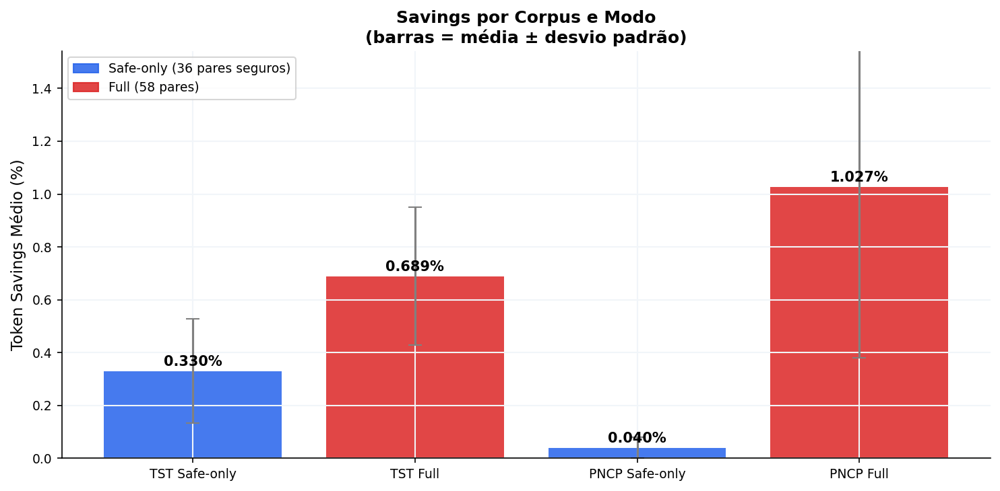

# synonym-arbitrage

**A methodology for finding synonym substitutions that reduce LLM token costs in non-English text.**

Most prompt optimization tools measure token cost wrong. Here's the correct way, and a worked example in Portuguese legal text.

---

## The Problem With Measuring Token Cost

```python
import tiktoken
enc = tiktoken.get_encoding("o200k_base")  # GPT-4o tokenizer

# This is how most tools measure:
len(enc.encode("fiscalização"))   # → 3 tokens
len(enc.encode("controle"))       # → 1 token
# "great, replacing fiscalização → controle saves 2 tokens!"

# This is how text actually appears in documents:
len(enc.encode(" fiscalização"))  # → 1 token  ← with leading space
len(enc.encode(" controle"))      # → 1 token
# savings: 0
```

BPE tokenizers learn common character sequences from training data. The leading space becomes part of the token. `" fiscalização"` is a single token in o200k_base — not three. Measuring in isolation gives false savings.

**This repo is about finding pairs where the in-context cost actually differs**, and using them as a preprocessing step before LLM calls.

---

## How It Works

```bash
git clone https://github.com/lucianfialho/synonym-arbitrage
cd synonym-arbitrage
pip install -e .
```

```bash
echo "A controvérsia foi resolvida." | synonyms compress --domain legal-pt
# → "A disputa foi resolvida."  (-3 tokens)
```

```python
from synonyms import Compressor

c = Compressor(domain="legal-pt", model="gpt-4o", safe_only=True)
result = c.compress("A controvérsia foi resolvida pelo magistrado.")
print(result.text)          # "A disputa foi resolvida pelo juiz."
print(result.tokens_saved)  # 4
```

---

## The Methodology

**Step 1 — Measure correctly** (with leading space):
```python
def token_cost(word, model="gpt-4o"):
    enc = tiktoken.get_encoding(MODEL_TO_ENCODING[model])
    return len(enc.encode(" " + word))  # space prefix = in-context cost
```

**Step 2 — Discover expensive words in your corpus:**
```bash
python discover.py --corpus-dir your/docs/ --min-tokens 2 --min-freq 5
```
```
consubstanciado    ×223   5 tok
arrematante        ×342   4 tok
controvérsia       ×719   4 tok  ✓ (already in dict)
notwithstanding    ×89    3 tok
indemnification    ×156   3 tok
```

**Step 3 — Find cheaper synonyms, validate semantics, add to dictionary.**

The hard part is validation. We include safety flags on every pair:

```json
{
  "controvérsia": {
    "replacement": "disputa",
    "safe": true,
    "notes": "4tok → 1tok in context. Semantically equivalent in most legal contexts."
  },
  "arrematante": {
    "replacement": "comprador",
    "safe": false,
    "notes": "4tok → 1tok. arrematante is auction-specific; comprador is generic. Use with care."
  }
}
```

---

## Benchmarks

Tested on 352 TST labor court decisions + 173 Brazilian public procurement documents (PNCP). All corpora are public and scrapers are included.

| Corpus | Mode | Mean savings | P90 |
|--------|------|-------------|-----|
| TST labor decisions | safe-only | 0.33% | 0.55% |
| TST labor decisions | full | 0.69% | 1.01% |
| PNCP contracts | safe-only | 0.04% | 0.07% |
| PNCP contracts | full | 1.03% | 1.66% |

These are modest numbers. We don't inflate them.

**Semantic preservation:** 40 Q&A pairs on original vs. compressed documents via Claude CLI. No factual divergence found. All apparent mismatches were formatting differences, not content changes.



---

## Apply To Your Language or Domain

The Portuguese legal dictionary is a worked example. The methodology applies to any domain where:

- The language is not English (BPE training data is English-dominated)
- Or the domain uses specialized jargon that BPE hasn't seen enough of

**Why non-English languages benefit more:**

English words like `notwithstanding`, `jurisdiction`, `confidentiality` are already 1 token in o200k_base — BPE learned them as single units. The equivalent terms in Portuguese, Arabic, German, Japanese are often fragmented into 2–5 tokens because they're rare in English-dominated training corpora.

**To build a dictionary for your language/domain:**

```bash
# 1. collect documents from your domain (any plain text files)
# 2. find expensive words
python discover.py --corpus-dir your/docs/ --min-tokens 2 --min-freq 5

# 3. for each candidate, find synonyms and check real savings:
python -c "
from synonyms.tokenizer import count as token_cost
print(token_cost('notwithstanding'))  # 1 — no savings possible
print(token_cost('hereinafter'))      # 3 — worth finding a substitute
"

# 4. add validated pairs to data/your-domain.json
# 5. run benchmark to measure actual impact
```

The `data/` folder is designed for multiple domain dictionaries. `legal-pt` is the first one.

---

## Limitations

- Works best on domain-specific jargon. Common words are already 1 token in context.
- Portuguese benefits more than English because BPE training data is English-dominated.
- Savings are 0.3–1% on average. Not transformative — an optimization, not a solution.
- Dictionary requires human curation. 58 pairs for PT legal, English dict in progress.
- Grammar agreement (gender in Portuguese) is handled for mapped pairs only.

---

## Reproduce

```bash
# clone and install
git clone https://github.com/lucianfialho/synonym-arbitrage
pip install -e .

# fetch real corpora (public data)
python scraper.py fetch 350        # Brazilian labor court decisions
python scraper_pncp.py fetch 200   # public procurement contracts

# run benchmarks with plots
python benchmark_full.py

# run semantic preservation test (requires claude CLI)
python semantic_test.py both 10
```

---

## Related Work

- Sennrich et al. (2016) — [Neural Machine Translation of Rare Words with Subword Units](https://arxiv.org/abs/1508.07909) — original BPE for NLP
- Oh & Schuler (2024) — [Leading Whitespaces of Language Models' Subword Vocabulary Pose a Confound for Calculating Word Probabilities](https://arxiv.org/abs/2406.10851) — documents the leading whitespace confound in BPE vocabularies
- Petrov et al. (2023) — [Language Model Tokenizers Introduce Unfairness Between Languages](https://arxiv.org/abs/2305.15425) — tokenizer unfairness across languages
- Kumar (2026) — [Is Sanskrit the most token-efficient language?](https://arxiv.org/abs/2601.06142) — quantifies the token tax empirically
- Jiang et al. (2023) — [LLMLingua: Compressing Prompts for Accelerated Inference of Large Language Models](https://arxiv.org/abs/2310.05736) — prompt compression via token dropping (lossy, requires auxiliary LLM)

This repo is different from LLMLingua: no tokens are removed, no auxiliary model needed. It's lossless substitution, not compression.

---

MIT License
